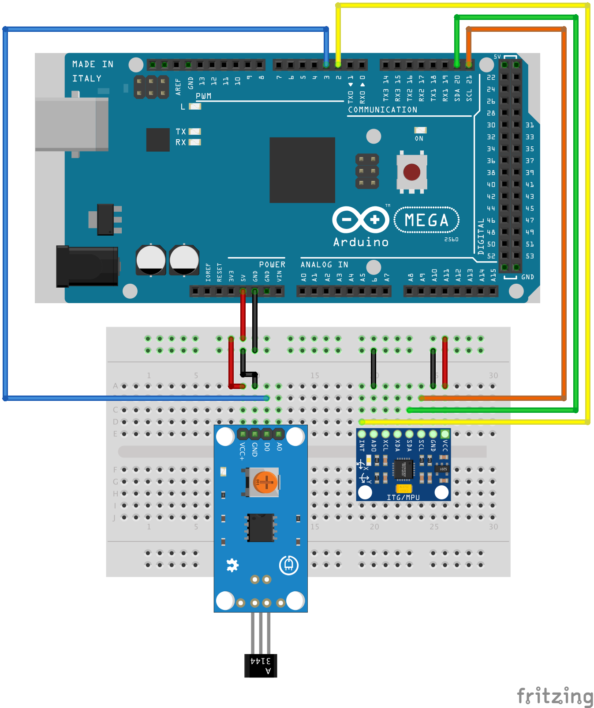
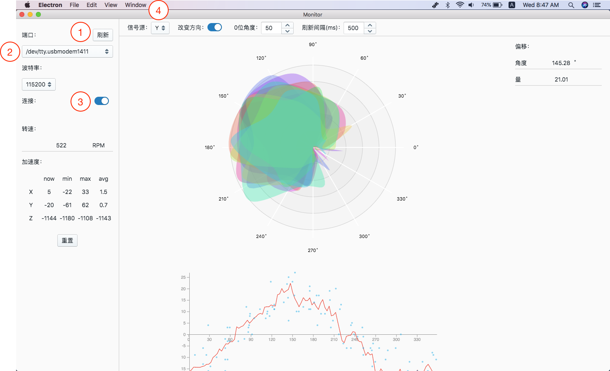

# Balencing
A tool to help you to resolve the dynamic balance problem.


This is an open source project, you can use it as you want. Hope this project will help you.

## Features
* Use a 3144 Hall-Effect sensor to sense the rotation angle, need a magnet on the shaft
* Use a MPU6050 Six-Axis Gyro + Accelerometer module to sense shake
* Gather data by Arduino
* An Electron App to show the result in real time, Mac OSX tested
* No extra hardware requirement, means you can use it in field or with a dedicated shelf

## How it Works
* 3144 Hall-Effect sensor will tell Arduino each time it meet the magnet
* The MPU6050 can tell Three-Axis shake it senses in nearly real time
* Arduino collect and pass the data above to the App, along with the timestamp
* The App decode those data and join each by angle along the time and the shake information
* Give you a radar chart and a X-Y chart to show the result
* Use a Loess algorithm to compute a fitting curve through those points in data
* Find the highest point in the curve, that's the most no-balence point of the shaft

## How to Use
* You need an Arduino, a 3144 Hall-Effect sensor and a MPU6050 Six-Axis Gyro + Accelerometer module
* Connect the hardware according to the diagram below:



* Upload the C code in ./arduino to your Arduino board. The main.cpp is in ./arduino/src/, and I use platformio to makeup the project, you can use it according to your situation
* run following command in the root dir of this project:
```
npm install
npm dist
```
Or you can just run this command to bypass the next step:
```
npm install
npm run all
```
* Connect Arduino to Computer by USB, open the App in ./dist folder
* Operate as following steps:



* Then you can choose which signal source of axis from MPU6050 is the best one for your situation, maybe by add some weight to one side of the shaft
* Find the zero angle, also the turning direction
* Use the graph and report from right side to start your balencing ajustment. Good luck!

## Thanks
I use lots of projects on GitHub and other information on web to finish this project, without those help, this project can never finished. Big thanks to all those intelligent people!

Don't forget to give a *Star* if you like it.

## Lisence
MIT
